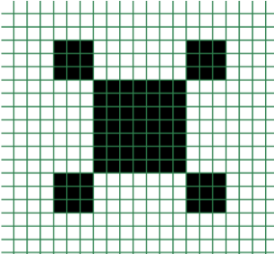
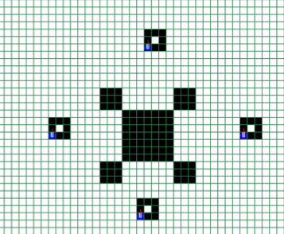
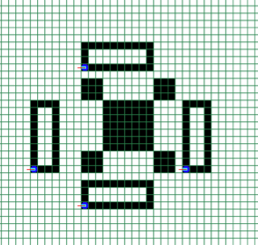
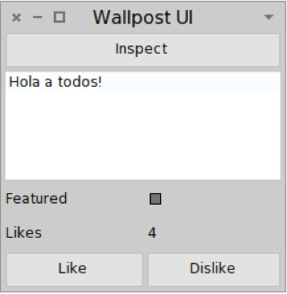

Orientación a Objetos 1 - 2014 - Práctica 2
===========================================

 Introducción
-------------

En esta práctica deberá utilizar el ambiente del robot en una versión más
avanzada, para ello copie, pegue en un workspace y ejecute el siguiente código:

```smalltalk
BGSArenaWindow expertViewOn: (OnTheFlyConfigurableSimulation batteryWalkingBrush).
```

Ejercicio 1:
-------------

El mundo de robots de esta práctica ya no tiene un robot al comenzar. El mismo
debe agregarse explicitamente por medio del botón etiquetado "Agregar Robot".
Al agregar unrobot debe indicarelnombre con el que se lo referenciará (en este
caso sugerimos utilizar la variable robotech). También es posible agregar un
robot haciendo click en cualquier posición de la arena; en este caso el robot
se ubicará en la posición clickeada.

Extienda el comportamiento del robot para que sea capaz de entender los
siguientes mensajes. Compruebe que el robot robotech reacciona correctamente.
Recuerde incluir el comentario del método en la definición de cada uno.

```smalltalk
position: aPoint
  "Posiciona al robot en la celda aPoint de la arena."
  ^ self body position: aPoint
```

```smalltalk
squareOfSize: aSize
  "Realiza un cuadrado con una esquina en su posición actual y de lado aSize."

  self
    brushDown;
    north;
    move: aSize;
    east;
    move: aSize;
    south;
    move: aSize;
    west;
    move: aSize;
    north;
    brushUp.
```
*Alternativamente:*

```smalltalk
rotateLeft: degrees
  "Gira el robot x cant de grados hacia su izquierda"

  | partial_dir |
  partial_dir := self direction - degrees.
  partial_dir < 0
    ifTrue: [ partial_dir := partial_dir + 360 ].
  self direction: partial_dir
```

```smalltalk
rotateRight: degrees
  "Gira el robot x cant de grados hacia su derecha"

  | partial_dir |
  partial_dir := self direction + degrees.
  partial_dir > 360
    ifTrue: [ partial_dir := partial_dir - 360 ].
  self direction: partial_dir
```

```smalltalk
squareOfSize: aSize
  "Realiza un cuadrado con una esquina en su posición actual y de lado aSize."

  self brushDown.
  4 timesRepeat: [
    self move: aSize;
    rotateRight: 90.
  ].
  self brushUp.
```

```smalltalk
squareOfSize: aSize at: aPoint
  "Realiza un cuadrado con una esquina en el punto aPoint y de lado aSize."

  self
    position: aPoint;
    squareOfSize: aSize
```

```smalltalk
squareAtHomeOfSize: aSize
  "Realiza un cuadrado con una esquina en 25@25 y de lado aSize."
  self squareOfSize: aSize at: (25@25)
```

```smalltalk
rotatedSquareOfSize: aSize
  "Realiza un cuadrado con una esquina en su posición actual, de lado aSize,
  rotado 45 grados."
  self
    rotateRight: 45;
    squareOfSize: aSize.
```

```smalltalk
rotatedSquareOfSize: aSize at: aPoint
  "Realiza un cuadrado con una esquina en aPoint, de lado aSize, rotado 45 grados."
  self
    rotateRight: 45;
    squareOfSize: aSize at: aPoint.
```


*Nota: implemente los métodos re­utilizando los métodos previamente definidos.*


Ejercicio 2:
------------

Agregue otro robot al que conocerá por medio de la variable afrodita. Compruebe
que la robot afrodita entiende los mensajes definidos en el Ejercicio 1 y
reacciona de igual forma que el robot robotech. ¿Qué sucede si modifica uno de
los métodos? ¿Siguen comportándose ambos robots de igual manera? ¿Por qué?
Discuta el por qué con un ayudante.


Ejercicio 3: PatrolCouple
-------------------------

Una PatrolCouple (pareja de guardia) está formada por dos robots: uno conocido
como patrol (patrulla) y el otro conocido como sniper (francotirador).

1. Defina la clase PatrolCouple y cree una instancia en el workspace.
PatrolCouple debe implementar el mensaje #patrol: sniper: que toma dos robots
como parámetros y los guarda en las variables de instancia que correspondan.

```smalltalk
Object subclass: #PatrolCouple
instanceVariableNames: 'patrol sniper'
classVariableNames: ''
category: 'BotArena'
```

```smalltalk
sniper: aRobot
 "Asigna un robot a sniper"

 sniper := aRobot.
```

```smalltalk
patrol: aRobot
  "Asigna un robot a patrol"

   patrol := aRobot.
```

```smalltalk
patrol: aPatrol sniper: aSniper
  "Asigna un patrol y un sniper"

  self
    patrol: aPatrol;
    sniper: aSniper
```

```smalltalk
sniper
  "Retorna un sniper"

  ^ sniper
```

```smalltalk
patrol
  "Retorna un patrol"

  ^ patrol
```

2. Cree dos robos diferentes para que sean patrol y sniper respectivamente.
Cree una instancia de PatrolCouple. Por último, envíe el mensaje #patrol:
sniper: con los robots como parámetros de instancia de PatrolCouple.

```smalltalk
| patrol_couple patrol sniper|
patrol_couple := PatrolCouple new.
patrol := WalkingBrushRobot new.
sniper := WalkingBrushRobot new.

patrol_couple patrol: patrol sniper: sniper
```

3. Según lo visto en la teoría, implemente el o los métodos necesarios para que
se puedan inicializar las instancias de PatrolCouple con los robots que lo
conforman por medio de un método de clase que se encargue de la "creación e
inicialización".

```smalltalk
newWithPatrol: aPatrol andSniper: aSniper
  "Crea e inicializa un PatrolCouple con robots."

  ^ self new patrol: aPatrol sniper: aSniper
```

Ejercicio 4:
------------

*PatrolCouple con comportamiento*

En este ejercicio agregaremos comportamiento a PatrolCouple con la siguiente
definición de mensajes:

```smalltalk
reset
  "Ambos robots se posicionan enfrentados a distancia 5 uno del otro (uno mira al
    south y el otro al north, uno de ellos posicionado en 20@20"

  self patrol
    north;
    position: (20@30).
  self sniper
    south;
    position: (20@25).
```

```smalltalk
regularPatrol
  "patrol hace un cuadrado de lado 10 rotado 45 grados alrededor de sniper,
    sniper en el centro gira en sentido de las agujas del reloj."

  self patrol rotatedSquareOfSize: 10 at: ((self sniper position x - 10)@(self sniper position y)).
  4 timesRepeat: [self sniper rotateRight: 90]
```


```smalltalk
regularPatrolTrace
  "Similar a regularPatrol pero patrol realiza un trazo con el brush"

  self patrol brushDown.
  self regularPatrol.
  self patrol brushUp.
```

```smalltalk
WalkingBrushRobot >> InstanceMethods

canDoPatrol: movements
  ^self battery charge >= (movements * 4 + 5)

canDoRegularPatrol
  ^self canDoPatrol: 10
```

```smalltalk
doTheRegularPatrol

  "Los guardias repiten regularPatrol 5 veces, pero luego de cada una se corren
  5 hacia el este. Considere usar bateria con suficiente carga"

  5 timesRepeat: [
      self patrol canDoRegularPatrol & (self sniper battery charge >= 9)
        ifTrue: [
          self patrol north.
          self regularPatrol ]
  ]
```

```smalltalk
doTheRegularPatrolTrace

  "Similar a doTheRegularPatrol pero cada robot deja un trazo en la arena con
  el brush"

  5 timesRepeat: [
      self patrol canDoRegularPatrol & (self sniper battery charge >= 9)
        ifTrue: [
          self patrol north.
          self regularPatrol ]
  ]
```

1. Realice el diagrama de clases.

2. Implemente los métodos pedidos (no olvide agregar los comentarios a cada
método). Y pruebe valiéndose del Workspace y el Inspector que funcionen
correctamente.

Ejercicio 5: Castle Watch
-------------------------

Castle’s Watch es un antigua orden de robots que protegen un castillo.



Para lanzar el ambiente con el castillo antes debe:

1. Cerrar su simulación y workspace arena.

2. Actualizar el ambiente del robot evaluando la siguiente sentencia:

```smalltalk
ConfigurationOfBotArena loadDevelopment
```

3. Lanzar el ambiente con la simulación de castillo:

```smalltalk
BGSArenaWindow expertViewOn: (CastleSimulation batteryWalkingBrush).
```

Defina la clase CastleWatch, la cual debe coordinar el accionar de los 4
guardianes conocidos como northWatch, southWatch, eastWatch y westWatch. Cada
guardián debe cubrir el correspondiente flanco del castillo.

```smalltalk
Object subclass: #CastleWatch
  instanceVariableNames: 'northWatch southWatch eastWatch westWatch robots'
  classVariableNames: ''
  category: 'BotArena'
```

*Implemente los siguientes métodos:*

```smalltalk
regularWatch

  "los robots realizan un cuadrado de lado 3 en su correspondiente flanco."

  self brushDown.
  self robots do: [ :robot| robot squareOfSize: 3]
  self brushUp
```

```smalltalk
paranoicWatch

  "cada robot realiza un recorrido del flanco completo, dibujando un rectangulo
  de 4x10"

  self brushDown.
  self robots do: [ :robot | robot rectangleWithBase: 4 andHeight: 10 ].
  self brushUp.

```

```smalltalk
WalkingBrushRobot >> InstanceMethods

rectangleWithBase: aBase andHeight: aHeight
  2 timesRepeat: [
    self
      move: aBase;
      rotateRight: 90;
      move: aHeight;
      rotateRight: 90 ]

defaultPosition: aPosition
  defaultPosition := aPosition

defaultPosition
  ^ defaultPosition

resetPosition
  self position: defaultPosition
```

*(algunos extra para que funcione lo de arriba)*

```smalltalk
initialize
  robots := OrderedCollection new
```

```smalltalk
robots
  ^ robots
```

```smalltalk
brushDown
  self robots do: [ :robot | robot brushDown ]
```

```smalltalk
brushUp
  self robots do: [ :robot | robot brushUp ]
```

```smalltalk
northWatch: aRobotN southWatch: aRobotS eastWatch: aRobotE westWatch: aRobotW
  self
    setNorthWatch: aRobotN;
    setSouthWatch: aRobotS;
    setEastWatch: aRobotE;
    setWestWatch: aRobotW.
```

```smalltalk
eastWatch
  ^ eastWatch

eastWatch: aRobot
  eastWatch := aRobot
```

```smalltalk
northWatch
  ^ northWatch

northWatch: aRobot
  northWatch := aRobot
```

```smalltalk
westWatch
  ^ westWatch

westWatch: aRobot
  westWatch := aRobot
```

```smalltalk
southWatch
  ^ southWatch

southWatch: aRobot
  southWatch := aRobot
```

```smalltalk

setEastWatch: aRobot
  self eastWatch: aRobot.
  self eastWatch
      defaultPosition: (36@26);
      east.
    robots add: eastWatch.
```

```smalltalk
setNorthWatch: aRobot
  self northWatch: aRobot.
  self northWatch
    defaultPosition: (26@16);
    north.
  robots add: northWatch
```

```smalltalk
setSouthWatch: aRobot
  self southWatch: aRobot.
  self southWatch
    defaultPosition: (26@36);
    south.
  robots add: southWatch
```

```smalltalk
setWestWatch: aRobot
  self westWatch: aRobot.
  self westWatch
    defaultPosition: (16@26);
    west.
  robots add: westWatch.
```

```smalltalk
reset
  self robots do: [ :robot| robot resetPosition ]
```


Note que siempre los robots deben dejar el rastro de su patrullaje. Por ej. el resultado de
regularWatch podria ser:





Mientras que el resultado del paranoicWatch podría ser:





Ejercicio 6: Wallpost
---------------------

En este ejercicio abandonamos el mundo del robot y nos manejamos con el Browser
del Sistema.

Debe desarrollar un post en un muro, al estilo de Facebook. Definimos un objeto
Wallpost con los siguientes atributos: un texto que se desea publicar, cantidad
de likes ("me gusta") y una marca que indica si es destacado o no.

```smalltalk
Object subclass: #Wallpost
  instanceVariableNames: 'likes featured text'
  classVariableNames: ''
  category: 'WallPost'
```

Defina la clase Wallpost en Smalltalk, con los siguientes mensajes:

```smalltalk
text
  "Retorna el texto descriptivo de la publicación"

  ^ text
```

```smalltalk
text: aString
  "Setea el texto descriptivo de la publicación"

  text := aString
```

```smalltalk
likes
  "Retorna la cantidad de 'me gusta' "

  ^ likes
```


```smalltalk
likes: aNumber
  "Setter para likes"

  likes := aNumber
```

```smalltalk
like
  "Incrementa la cantidad de likes en uno"

  self likes: self likes + 1
```

```smalltalk
dislike
  "Decrementa la cantidad de likes en uno. Si ya es 0, no hace nada"

  self likes > 0 ifTrue: [ self likes: self likes - 1 ]
```

```smalltalk
featured
  "getter para featured"

  ^ featured
```

```smalltalk
featured: aValue
  "setter para featured"

  featured := aValue
```

```smalltalk
isFeatured
  "Retorna true si el post esta marcado como destacado, false en caso contrario"

  ^ self featured
```

```smalltalk
toggleFeatured
  "Cambia el post del estado destacado a no destacado y viceversa"

  self featured: self featured not
```

```smalltalk
initialize
  "Inicializa el estado de las variables de instancia del Wallpost. Luego de
  la invocación el Wallpost debe tener como texto: 'Undefined post', no debe
  estar marcado como destacado y la cantidad de 'Me gusta' deben ser 0."

  self
    text: 'Undefined post';
    featured: false;
    likes: 0.
```

Utilice el test provisto por la cátedra para comprobar que su implementación de
Wallpost es correcta.


Ejercicio 7: Ventana del Wallpost
----------------------------------

Una vez que su implementación pasa los tests del ej anterior puede utilizar la
ventana que se muestra a continuación, la cual permite inspeccionar y manipular
el post (definir su texto, hacer like y dislike, marcarlo como destacado).

Para abrir la ventana puede evaluar la siguiente expresión en el workspace:

```smalltalk
WallpostUI on: (Wallpost new)
```



1. En la expresión: ` WallpostUI on: (Wallpost new) ` se instancian 2 objetos,
el wallpost y la ventana. Discuta con un ayudante

* ¿En qué difieren las instanciaciones?

>Una esta hecha con un constructor con parametros y la otra simplemente
>ejecuta el new (y si esta definido el initialize)

* En el ej. anterior ud.implementó el método #initialize, pero, ¿quien lo
invoca? Ayuda: coloque un breakpoint en el método initialize para ver quién
lo invoca. Ayuda de la ayuda: para poner un breakpoint agregue la sentencia
self halt. al código del método #initialize.

>El initialize es invocado por el new.


Ejercicio 8: Leyendo código
---------------------------

Leer código ayuda a conocer convenciones sobre cómo se escribe el código en
Smalltalk. Utilizando el browser y mirando cualquier clase o conjunto de clases
y sus métodos responda:

1. ¿Los nombres de clase comienzan con minúscula o mayúscula?

>En Mayuscula.

2. ¿Cómo se escriben los nombres de métodos?

>En minuscula.

3. ¿Para qué se usan los protocolos?

>Para organizar los metodos de los objetos.

4. ¿Qué pasa si un método no tiene un protocolo asignado?

>Absolutamente nada, solamente aparecera dentro de 'as yet unclassified'

5. Busque la clase DateAndTime y:

  1. Mencione al menos 3 clases a las que se haga referencia desde el código de
  la clase DateAndTime.

    >SecondsInDay, DosTimestamp, Duration

  2. Busque el método más largo de la clase. ¿Qué pasa en el browser cuando
  aparece un método largo?. ¿Qué conclusión puede sacar al respecto?

    >'printOn: withLeadingSpace:' Aparece una senial de alerta. esta mal
    >visto tener metodos demasiado largos, deberian ser modularizados

  3. Busque un método que haga uso de variables temporales, y dos métodos que
  usen de instancia.  Discuta con el ayudante sobre el uso que se les da a las
  variables temporales.

    >Las variables temporales se usan para datos que se pueden perder,
    >mientras que las variables de instancia se utilizan para preservar estado
    >de los objetos.


Ejercicio 9: Evaluación de expresiones
--------------------------------------

1. ¿Qué devuelve Smalltalk cuando se evalúan las siguientes expresiones?
Realice el ejercicio en papel, tenga en cuenta el estado del ambiente producido
por las evaluaciones previas.

```smalltalk
 x := 2 * 5 factorial. "=> 240"

 y := x + 1. "241"

 |n| n := n+1. "=> revienta, n es nil y no entiende el mensaje +"

 |n m| n := 4. m := 1. ^(n+m+x+y). "486"

 5 timesRepeat: [x := x + y]. "=> 1445"

 'objeto' at:2 isVowel. "revienta porq se le esta mandando el mensaje al 2 en
 vez de la letra 'b'"
```

2. Dado un triángulo rectángulo representado por las variables temporales base
y altura, escriba las expresiones en Smalltalk para calcular:

```smalltalk
Object subclass: #TrianguloRectangulo
instanceVariableNames: 'base altura'
classVariableNames: ''
category: 'Triangulos'
```

a. La superficie
```smalltalk
superficie
  "calcula la superficie del triangulo"

  ^ (self base * self altura) / 2
```
b. La hipotenusa
```smalltalk
hipotenusa
  "calcula la hipotenusa del triangulo"

  ^ (self base squared + self altura squared) sqrt
```
c. El perímetro
```smalltalk
perimetro
  "calcula el perimetro del triangulo"

  ^ self base + self altura + self hipotenusa.
```
d. true si el perímetro es mayor a unPerimetro o false en caso contrario
```smalltalk
perimetro_mayor_que: unPerimetro

  ^ self perimetro > unPerimetro
```
e. Implemente en Smalltalk y verifique su correcto funcionamiento.


3. Dada la clase Wallpost creada anteriormente, escriba las siguientes expresiones en Smalltalk:

  a. Cree una instancia de Wallpost, unWallpost.
  ```smalltalk
  |unWallpost|
  unWallpost := Wallpost new.
  ```
  b. Incremente los likes de unWallPost hasta llegar a 20.
  ```smalltalk
  [ unWallpost likes < 20 ] whileTrue: [ unWallpost like ]
  ```
  c. Cree otra instancia de Wallpost, otroWallpost.
  ```smalltalk
  otroWallpost := Wallpost new.
  ```
  d. Obtener el texto del Wallpost con más likes.

  ```smalltalk
  unWallpost likes > otroWallpost likes
    ifTrue: [ unWallpost text ]
    ifFalse: [ otroWallpost text ]
  ```

  e. Si el post unWallpost tiene más de 100 likes, márquelo como featured.

  ```smalltalk
  unWallpost likes > 100
    ifTrue: [ unWallpost featured: true ].
  ```

  f. Evalúe a true si ambos tienen más de 20 likes

  ```smalltalk
  (unWallpost likes > 20) & (otroWallpost likes > 20).
  ```

  g. Cree una nueva instancia de Wallpost que sea la "concatenación" de ambos.
  Esto es que el texto debe ser la concatenación de los textos de ambos, sus
  likes deben ser la suma de ambos likes, y debe estar marcado como featured si
  al menos alguno de ellos lo está.

  ```smalltalk
  union := Wallpost new.
  union text: unWallpost text,otroWallpost text.
  union likes: unWallpost likes + otroWallpost likes.
  union featured: unWallpost isFeatured | otroWallpost isFeatured.
  ```

 4. Dada una variable aNumber, escriba la expresión para calcular la suma de los primeros aNumber
 números naturales.

 ```smalltalk
  |sum|
  sum:=0.
  1 to: aNumber do: [:i | sum := sum + i].
 ```
 5. Dada la siguiente expresión:

 ```smalltalk
   3 + 5 > 6 ifTrue: [ 4 ] ifFalse: [ 5 ] "=> 4"
 ```

   * ¿Qué valor se obtiene al ser evaluada? ¿Cómo la modificaría para obtener el valor 8?

    ```smalltalk
      3 + (5 > 6 ifTrue: [ 4 ] ifFalse: [ 5 ]) "=> 8"
     ```

Ejercicio 10:
-------------

Considerando la clase DateAndTime, busque ejemplos de métodos donde se utilizan
paréntesis para forzar cierto orden particular en la evaluación de mensajes.
Discuta con un ayudante, mirando el código, qué pasaría si los paréntesis no
estuvieran allí.


Ejercicio 11: Documentar la batería con UML
-------------------------------------------

 1. Utilizando el System Browser de Pharo, acceda a la definición de la clase
 Battery.

 2. Viendo la definición de la clase Battery, realice un diagrama de Clases UML
 que la documente.

Ejercicio 12: (Avanzado)
------------------------

Implemente un nuevo tipo batería que se llama `EnergyRecoveryCell`. Este tipo
de batería tiene el mismo comportamiento que la clase Battery pero ademas se
recarga mientras el robot se mueve. Una instancia de `EnergyRecoveryCell`
recarga 1 unidad de energía por cada 10 unidades de energía consumidas. Tenga
en cuenta que es indistinto si las 10 unidades se consumen en una sola movida
del robot o en varias.

Verifique su implementación utilizando el test case provisto por la cátedra

```smalltalk
initialize
  super initialize.
  self steps: 0
```

*(no usar este metodo, rompe los tests de la catedra)*

```smalltalk
canConsume: amount
  "considera si puede avanzar, tiene en cuenta recargas"
  ^ self charge + (amount + steps // 10) >= amount
```

```smalltalk
consume: amount

  | full |
  super consume: amount.
  full := amount + self steps.
  self
        charge: (self charge + (full // 10));
    steps: full \\ 10
```

```smalltalk
steps: aNumber
  "setters"

  steps:= aNumber
```

```smalltalk
steps
  "getters"

  ^ steps
```

### EnergyRecoveryCell con cantidad de carga por parametro.

La idea es instanciar una `EnergyRecoveryCell` especificando la cantida que va
a recargar cada 10 pasos.

```smalltalk
Battery subclass: #EnergyRecoveryCell
  instanceVariableNames: 'steps defaultCharge'
  classVariableNames: ''
  category: 'BotArena-Modules'.

EnergyRecoveryCell class>> newWithDefaultCharge: aCharge
  ^ self new defaultCharge: aCharge.

EnergyRecoveryCell>> initialize
  super initialize.
  self
    steps: 0;
    defaultCharge: 1.

EnergyRecoveryCell>> consume: amount
  | full |
  super consume: amount.
  full := amount + self steps.
  self
        charge: (self charge + (full // 10 * self defaultCharge));
    steps: full \\ 10.

```

Esto se usaria de esta manera:

```smalltalk
|batt|
batt := EnergyRecoveryCell newWithDefaultCharge: 5.
batt charge: 100;
    consume: 10;
    charge. "=> 95"
```
