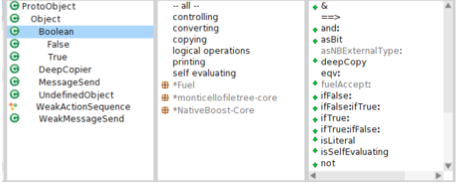
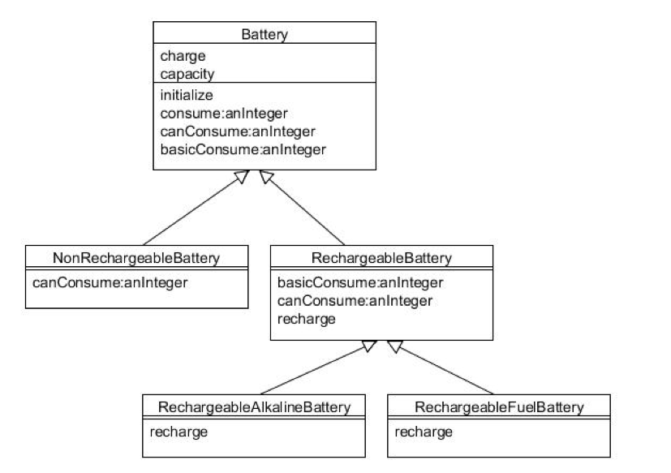

Orientación a Objetos 1 - 2014 - Práctica 3
===========================================

Ejercicio 1: Explorando Pharo
------------------------------

Abra el Browser Nautilus y desarrolle las siguientes tareas:

1. Busque la clases ProtoObject y Object.

2. Lea los comentarios de los métodos `#=`  (en Object) y `#==` (en
ProtoObject) y explique la diferencia entre ambos. Verfique con un ayudante.

    >Ambos son metodos para comparar dos objetos, pero el '#=' esta hecho para
    >poder ser redefinido ya que lo unico que hace es llamar al '#==' que hereda
    >de 'ProtoObject'

3. Encuentre todas las implementaciones del método `#=` e `#==` a. Una manera
de hacerlo es seleccionar el método y utilizar el menu contextual:
"Implementors of..."

4. Encuentre todos los métodos donde a algún objeto se le envía el mensaje
`#==` y `#=`.

    >'#==' Esta implentado solo una vez mientras que '#=' esta implementado en
    >varias clases.

    `Una manera de hacerlo es seleccionar cada uno de los métodos y utilizar el
    menu contextual: "Senders of"`

    ¿Puede asegurar para cada caso que método `#==` y `#=` será ejecutado?

    ¿Por qué?

5. Encuentre todas las implementaciones del método `#size`.

    >Una manera de hacerlo es seleccionar el método y utilizar el menu contextual:
    >"Implementors of.."

6. ¿Qué uso se da al protocolo private? ¿Qué implica que un método esté en el
protocolo private?

    >El protocolo privado sirve para agrupar métodos, es un nombre nomas.
    >Implica que esos metodos no podrian usarse.

7. Busque la implementación por default de  `#initialize`. Discuta con un
ayudante el porqué de dicha implementación.

    >La implimentacion de initialize esta vacia.
    >
    >Para que cada clase lo puedo sobreescribir y si no lo hace no pasa nada,
    >porque se ejecuta ese método vacio.

8. Si inspecciona el protocolo de Boolean, en browser, al lado de los mensajes,
verá flechas verde. ¿Qué indican las flechas hacia arriba? ¿Y hacia abajo?

    

    >Significa que ese mensaje esta definido en su clase padre o esta definida en
    >una de sus subclases.


Ejercicio 2: Clases Vs. Instancias
----------------------------------

En un procesador de texto la clase Document representa un documento de texto
que debe tener un título (title) y un texto principal (body).  Document debe
responder a los siguientes mensajes:

```smalltalk
title: aTitle
  title := aTitle

title
  ^title
```

```smalltalk
body: aBody
  body := aBody

body
  ^body
```

```smalltalk
Document>> size
  "retorna el tamaño del documento que es la suma del tamaño del título, el
  tamaño del body y el overhead del documento que siempre es el 10% del body"

  ^ self body size + self title size + (self body size * 0.1)
```

```smalltalk
Document>> addLine: aString
  "agrega (concatena) al body la linea aString"

  self body: self body, aString
```

```smalltalk
Document class>> titled: aString
  "Retorna una nueva instancia de Document, cuyo título es aString"

  ^ self new title: aString; body:''.
```
*Tareas:*

1. Complete la implementación en Smalltalk.

2. Instancie en un workspace y verifique el funcionamiento.

3. Considerando el fragmento de código (los nros a la izquierda indican número
de línea de código):

```smalltalk
| doc |
doc:= Document titled:'Objetos'.
doc size.
doc class.
doc class allInstances.
Document allInstances.
doc addLine: 'bla'.
doc class == Document
```


*Conteste:*

1. ¿doc es una clase a una instancia?

    >doc es un instancia de la clase Document.

2. Al evaluar la línea 3, ¿de qué clase es el resultado de dicha evaluación?

    >Float

3. El resultado de la evaluación de la línea 4,  ¿es una clase o una instancia?

    >Es una clase.

4. ¿Cuál es el resultado de evaluar la línea 8? ¿Qué conclusión puede sacar al respecto?

    >El resultado es 'true'.
    >
    >doc es una instancia de la clase Document. doc class retorna Document.
    >Document == Document Si.

Ejercicio 3: Method Lookup
--------------------------

Se tienen definidas en Smalltalk las siguientes clases con el siguiente
comportamiento



```smalltalk
Object subclass: #Battery
instanceVariables: 'capacity charge'

Battery>> initialize
  capacity := 100.
  charge := capacity.

Battery>> consume: anInteger
  (self canConsume: anInteger)
    ifTrue:[self basicConsume:anInteger]
    ifFalse:[Transcript show: 'Batería descargada']

Battery>> canConsume: anInteger
  ^ self subclassResponsibility

Battery>> basicConsume: anInteger
  charge := charge ­ anInteger

Battery subclass: #NonRechargeableBattery

NonRechargeableBattery>> canConsume: anInteger
  ^ charge >= anInteger
```

```smalltalk
Battery subclass: #RechargeableBattery

RechargeableBattery>> basicConsume: anInteger
  charge := charge - anInteger.
  charge <= (capacity / 10)
    ifTrue: [self recharge]

RechargeableBattery>> canConsume: anInteger
  ^ anInteger <= capacity

RechargeableBattery>> recharge
  ^ self subclassResponsibility

```

```smalltalk
RechargeableBattery subclass: #RechargeableAlkalineBattery

RechargeableAlkalineBattery>> recharge
  charge := capacity.
  Transcript show: 'Recharging alkaline battery...'
```

```smalltalk
RechargeableBattery subclass: #RechargeableFuelBattery

RechargeableFuelBattery >> recharge
  charge := capacity.
  Transcript show: 'Recharging fuel battery...'
```

*Conteste:*

¿Qué mensajes se imprimen en el Transcript y con cuánta carga queda cada una de
las baterías, si dentro de una ventana de Workspace se evalúan las expresiones
de los siguientes ejemplos?

*Ejemplo 1:*

```smalltalk
nrb := NonRechargeableBattery new.
nrb consume: 70.
nrb consume: 35.
```


*Ejemplo 2:*
```smalltalk
rab := RechargeableAlkalineBattery new.
rab consume: 70.
rab consume: 35.
```


Ejercicio  4: Perfil y Karma
----------------------------


Sea una red social en la que se requiere representar el perfil de una persona
de la siguiente manera: de cada persona interesa saber el nombre, la cantidad
de posts que realizó en el último mes, la cantidad total de likes que obtuvo en
el último mes (el total, no por post) y el "karma" que tiene esa persona.

El karma es un número que representa la relevancia del usuario en la red social
y se incrementa con el correr de los meses, tal como se explica a continuación.

Mensualmente se computa nuevos puntos de karma a partir de la cantidad de posts
y la cantidad de likes. La forma de calcular el nuevo valor de karma es la
siguiente: se realiza la división de la cantidad de posts en el último mes por
la cantidad de likes obtenidos también en el último mes.

* Si el valor obtenido está entre 0 y 30 no obtiene nuevos puntos de karma.

* Si el valor obtenido está entre 31 y 50 obtiene 2 puntos de karma (que se
suman al karma que el usuario ya tiene).

* Por 51 o más obtiene 3 puntos de karma.

* Una vez realizado el cálculo de karma, los contadores de posts y likes
mensuales se setean en 0 nuevamente.

*Tarea:*

1. Identifique objetos y responsabilidades.

2. Realice un diagrama de clases.

3. Implemente en Smalltalk.

4. Instancie en un workspace y verifique que el cálculo de karma funciona
correctamente

Considere que cuando se crea un usuario debe tener sus contadores y nombre
correctamente inicializados. Por lo tanto implemente el constructor
correspondiente.


Ejercicio 5: Perfil y Karma Extendido
-------------------------------------

La red social del ejercicio anterior se propuso tener 2 tipos de usuarios:
`Silver` y `Gold`. Los numeros de posts y likes se manejan de la misma que en
el enunciado anterior.

En el caso del usuario Silver el karma se calcula como:
`posts * likes / Float pi`

En el caso del usuario Gold el karma se calcula como:
`posts * likes / Float halfPi`

Considerando la implementación del ejercicio anterior determine:

1. ¿Qué modificaciones o extensiones debe hacer a la resolución del ejercicio 4?

2. ¿Que comportamiento tienen en común los usuarios Gold y Silver?

3. La superclase de ambos usuarios, ¿puede instanciarse?

4. En el caso en que no pueda instanciarse, ¿cuál es la manera en Smalltalk de
definir una clase de ese tipo?


Ejercicio 6: Robot (Avanzado)
-----------------------------

Analice la jerarquía de clases correspondientes al robot que usó en las 2
primeras prácticas (WalkingBrushRobot).

1. Analice la implementacion de `#position` en toda la jerarquía. ¿Es necesaria
la redefinición que se hizo en `WalkingBrushRobot`? Justifique.

    >No, no es necesaria la redefinicion de #position, porque los dos métodos
    >son iguales, estan definidos de la misma manera

2. ¿Cuáles son los constructores que se definieron? ¿Para qué sirve cada uno?

    >`withBattery`      instancia un robot con bateria.
    >
    >`withoutBattery`   instancia un robot sin bateria.
    >
    >`newWithPosition:` instancia un robot en una posicion dada.

3. Analice las clases Battery y EndlessBattery.

      1. ¿Cuál es el protocolo en común?
           > El protocolo común es #consume: y #canConsume:

      2. ¿Qué puede concluir al respecto?
           > Se puede concluir que hay polimorfismo.

      3. ¿Es necesario que objetos polimórficos pertenezcan a la misma
         jerarquía?
          > No no es necesario que pertenezcan a la misma jerarquia.
          >
          > Hay Polimorfismo cuando es posible enviar mensajes sintácticamente
          > iguales a objetos de tipos distintos.

4. Liste las clases de las cuales hereda WalkingBrushRobot y para cada caso
documente las variables de instancia
    >`WalkingBrushRobot` hereda de OTFRobot variables son: 'commands semaphore'
    >
    >`OTFRobot`          hereda de BGSRobot variables de instancia son: 'id body'
    >
    >`BGSRobot`          hereda de Objects no tiene variables de instancia.
    >
    >`Objects`           hereda de ProtoObjects no tiene variables de intancia.

5. Analize las referencias a la variable de instancia #body de la clase BGSRobot,

  1. cómo se inicializa esta variable?

        ```smalltalk

            initialize
              ...
              self body: self bodyClass new.

            bodyClass
              ^BGSRobotBody.
        ```

  2. que retorna el mensaje `#bodyClass` de la clase `BGSRobot`?

        >Retorna un objeto clase BGSRobotBody.

6. Modifique la clase `WalkingBrushRobot` para que se inicialize con otros tipos de "body"

    >Una opcion seria redefinir el mensaje 'bodyClass' para que devuelva otras clases

    ```smalltalk
    OTFRobot>> bodyClass
      ^OtraClase
    ```

    >Otro opcion seria definir algun constructor que reciba una instancia de un
    >'body' u otra clase y la instancie.

    ```smalltalk
    WalkingBrushRobot>> newWithBody: aBodyClass
      super new
      self body: aBodyClass new
      yourself
    ```

`Puede buscar una clase usando la combinación de teclas Cmd o Ctrl + F,C`

`Para ver la jerarquía haga click en el botón Hierarchy.`

Ejercicio 7: Carrito de compras
-------------------------------

En un sitio de compras por internet un cliente puede comprar muchos productos
que pone en su carrito. Al finalizar la compra se debe calcular el total a
abonar.  De cada producto se conoce su nombre y su precio. El carrito debe
permitir ir sumando de a uno los productos, hasta que el cliente decide hacer
el checkout. No es necesario almacenar los productos, sino sumar el valor total
de la compra y la cantidad de productos adquiridos. Si la cantidad de productos
supera los 10, debe aplicar un descuento del 10%. Si el monto total a abonar
supera los 10.000$ se le aplica un 5% de descuento.

*Tareas*

1. Identifique los objetos y responsabilidades.

2. ¿Qué comportamiento debe proveer el carrito?

3. Implemente en Smalltalk (recuerde implementar los constructores)

4. Piense 3 casos de prueba que le permitan verificar que su implementación
funciona de la manera esperada.

5. Implemente esos casos de prueba y ejecútelos en un workspace.
