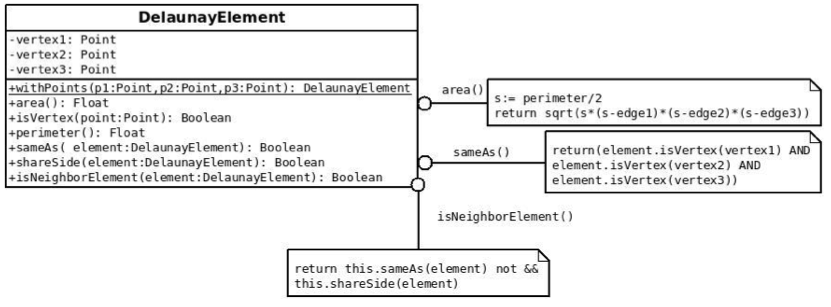
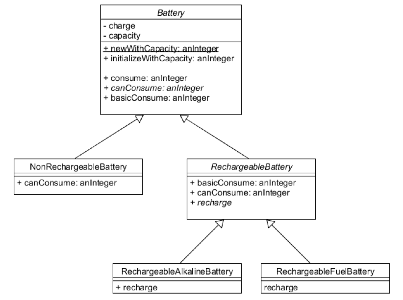
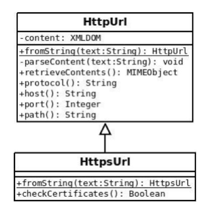
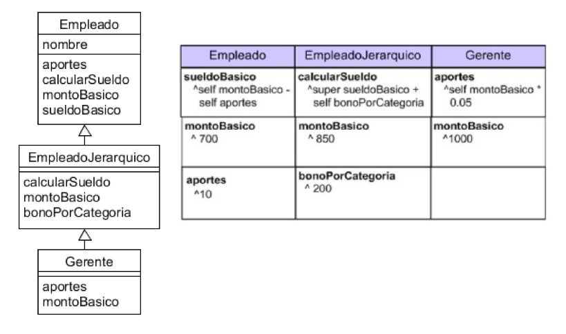
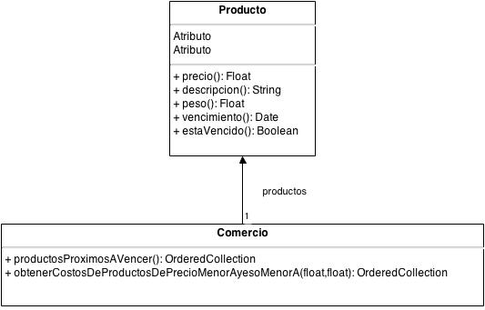

Orientación a Objetos 1 - 2014 - Práctica 4
============================================

Ejercicio 1: El mensaje #between:and:
-------------------------------------

Ejecute paso a paso las siguientes expresiones utilizando la acción `Into` del
Debugger para responder las preguntas que se hallan a continuación:

```smalltalk
$4 between: $t and: $y.
```


```smalltalk
3@3 between: 1@1 and: 3@4.
```

*Responda:*

1. ¿Dónde está implementado el código de `#between:and:`?
    > Esta implementado en la clase `Magnitude`

2. ¿Dónde están implementados los métodos `#<=` y `#>=`?
    > Estan implementados en las clases que heredan de `Magnitude` y necesitan
    > modificar su funcionamiento

3. ¿Los caracteres y los puntos necesitan implementar `#between:and:`?
    > No, ya que redefinen `>`, `<` y `=`

    ¿Los caracteres y los puntos necesitan implementar los métodos `#<=` y `#>=`?
    > Si, ya que los conceptos mediante los cuales hacen las comparaciones
    > pertinentes difieren entre clase y clase

    *Justifique.*

4. Busque en `Magnitude` otro ejemplo similar a `#between:and:` donde un método
envía mensajes a objetos polimórficos.
    > `max:`

Ejercicio 2: Intervalo de tiempo:
---------------------------------

En Smalltalk, las fechas se representan con instancias de la clase `Date`. Por
ejemplo, el envío del mensaje `#today` a la clase `Date` retorna la fecha actual.

Tareas:

1. Investigue cómo hacer para crear una fecha determinada, por ejemplo
'29/06/1986'.

    ```smalltalk
    fecha := Date newDay: 29 month: 06 year: 1986
    ```

    ```
    Sugerencia: vea los mensajes de clase de la clase `Date`, en el protocolo
    instance creation.
    ```

2. Investigue cómo hacer para ver si la fecha de hoy está entre las fechas
'29/06/1986' y '29/06/2018'

    ```smalltalk
        fecha := Date newDay: 29 month: 06 year: 1986.
        fecha2 := Date  newDay: 29 month: 06 year: 2018.
        Date today between: fecha and: fecha2.
    ```

    ```
    Sugerencia: vea los métodos de instancia que `Date` hereda de `Magnitude`
    (protocolo testing).
    ```

3. Un objeto `Date`Lapse representa el lapso de tiempo entre dos fechas. La
primera fecha se conoce como `from` y la segunda como `to`.

  Implemente la clase `DateLapse` (lapso de tiempo). Para ello, debe utilizar la
  definición que se encuentran en el archivo `DateLapse.st`, completándola de
  acuerdo a la siguiente especificación. Una instancia de esta clase entiende los
  mensajes:

    ```smalltalk
    DateLapse>> from
      "Retorna la fecha de inicio del rango"
    ```
    

    ```smalltalk
    DateLapse>> to
      "Retorna la fecha de fin del rango"
    ```
    

    ```smalltalk
    DateLapse>> from: aDateFrom to: aDateTo
      "Es un método privado que asigna la fecha inicial y final de un objeto
      DateLapse" 

    ```

    ```smalltalk
    DateLapse>> sizeInDays
      "retorna la cantidad de días entre la fecha from y la fecha to"
    ```
    

    ```smalltalk
    DateLapse>> includesDate: aDate
      "recibe un objeto Date y retorna true si la fecha está entre
      el from y el to del receptor y false en caso contrario"
    ```
  

  > Solucion: [DateLapse](src/practica_4/DateLapse.st)

4. Ejecute los tests provistos por la cátedra para verificar su implementación,
los mismos se encuentran definidos en la clase `DateLapseTest`, en el archivo
`DateLapseTest.st`.

5. Asumiendo que implementó la clase `DateLapse` con dos variables de instancia
`from` y `to`, modifique la implementación de la clase para que su
representación sea a través de los atributos `from` y `sizeInDays`. Es decir,
debe basar su nueva implementación en estas variables de instancia solamente.
Sugerencia: si quiere conservar la versión original, antes de realizar algún
cambio haga un fileOut de la clase `DateLapse`.

  > Solucion: [DateLapseSizeInDays](src/practica_4/DateLapseSizeInDays.st)

6. Vuelva a correr los tests. Los cambios en la estructura interna de un objeto
sólo deben afectar a la implementación de sus métodos. Estos cambios deben ser
transparentes para quien le envía mensajes, no debe notar ningún cambio y
seguir usándolo de la misma forma.


Ejercicio 3: DateLapse
----------------------

Defina ahora los mensajes necesarios para crear una instancia de `DateLapse` a
partir del envío de un mensaje a un objeto `Date`. Usted debería escribir algo
de la siguiente forma para instanciar el `DateLapse`.

`unaFecha ~> otraFecha`

```smalltalk
Date>> ~> aDate

  ^DateLapse from: self to: aDate
```

Notar que esto es similar a lo que ocurre con los objetos Point que se pueden
crear a partir del envío de un mensaje a un objeto número. La expresión `3@5`
al ser evaluada retorna un objeto `Point` con coordenada `x=3` y con coordenada
`y=5`.


Ejercicio 4: Triangulación de Delaunay I
---------------------------------------

Una Triangulación de Delaunay es una red de triángulos que suele ser utilizado
en muchas aplicaciones (programas) que necesitan hacer cálculos basados en
geometría, como por ejemplo superficie.

1. Estudie el siguiente diagrama de la clase DelaunayElement (que permite
modelar triángulos).

Considere los siguientes puntos:

  * La sintaxis para definir operaciones en UML es diferente que la sintaxis de
  los métodos en Smalltalk

  * La operación `shareSide(:DelaunayElement)` retorna si dos triángulos
  comparten un lado o no

  * Hay un constructor que recibe multiples parámetros:

  `withPoints(p1 Point, p2 Point, p3 Point)`

Cómo implementaría esto en Smalltalk?

1. Implemente en Smalltalk

Considere los siguientes puntos:

  * Las instancias de la clase Point entienden el mensaje #dist:. Este método
  espera como parámetro otra instancia de Point y devuelve un numero que
  representa la distancia (geométrica) entre esos dos puntos

  * En el cálculo del área se utiliza (Formula de Heron) el perímetro y cada uno
  de los lados, mientras que el DelaunayElement guarda los vértices del
  triángulo. Cuál es la mejor manera de implementar el "calculo" de cada uno de
  los lados?

  * La operación sameAs() retorna un booleano que dice si dos triangulos son
  iguales. Cómo podría implementar este método en Smalltalk?

  * La operación shareSide() retorna un booleano que dice si dos triangulos
  tienen un lado en común

  * La operación isNeighborElement() retorna un booleano que dice si dos
  triangulos son vecinos: no son el mismo y comparten un lado.



Ejercicio 5
-----------

Implementar en Pharo las siguientes operaciones lógicas: `implies`, `nand` y
`nor`.  Las operaciones deben ser mensajes enviados a objetos booleanos y están
definidas de acuerdo con las siguientes tablas de verdad:

*Implies:*

  a     | b     | a implies: b
  ------|-------|-------------
  false | false | true
  false | true  | true
  true  | false | false
  true  | true  | true

```smalltalk
Boolean>> implies: aBoolean

  ^self ==> [ aBoolean ].
```

*Nand*

  a     | b     | a nand: b
  ------|-------|-----------
  false | false | true
  false | true  | true
  true  | false | true
  true  | true  | false

```smalltalk
Boolean>> nand: aBoolean
  ^ (self & aBoolean) not.

"Alternativamente:"

False>> nand: aBoolean
  ^ self not.

True>> nand: aBoolean
  ^ self xor: aBoolean.
```

*Nor*

  a     | b     | a nor: b
  ------|-------|-------------
  false | false | true
  false | true  | false
  true  | false | false
  true  | true  | false

```smalltalk
Boolea>> nor: aBoolean

  ^ (self | aBoolean) not.
```

Utilice los TestCases provistos por la cátedra para probar su implementación.


Ejercicio 6
-----------

Tanto `and:` como `&` representan al "y" lógico. Investigue qué recibe como
parámetro cada uno de estos mensajes y cómo influye en las operaciones lógicas.

> Dentro de `False` tanto `and:` como `&` devuelven `self`
>
> Dentro de `True` `and:` recibe un bloque el cual es evaluado, mientras q
> `&` recibe `aBoolean` y retorna su valor

Ejercicio 7: el mensaje #whileTrue:
-----------------------------------

Analice el siguiente código:
```smalltalk
i := 0.
[ i < 5 ]
  whileTrue: [
    Transcript show: 'Que lindo es Smalltalk'.
    i := i + 1.
  ]
```

*Tareas:*
1. Indique qué efecto tiene el código.

2. Busque la clase donde se implementa el mensaje `#whileTrue:`

3. Conteste: ¿Por qué no tiene sentido implementar este mensaje en la clase
Boolean?.

4. Analice la implementación del mensaje `#whileTrue:`. Conteste: ¿cuál es el
mensaje que permite ejecutar un bloque?  



Ejercicio 8: Diagramas UML
--------------------------

Analice los siguientes Diagramas de Clases y conteste las preguntas:



*Responda:*

1. Liste los mensajes que entiende una instancia de RechargeableFuelBattery.

2. ¿A una instancia de `RechargeableAlkalineBattery` se le puede enviar el
mensaje `consume: anInteger`? Justifique su respuesta.

3. ¿Qué significa un mensaje subrayado en un diagrama de clases?

4. ¿Qué significa el nombre de una clase en cursivas en un diagrama de clases?
¿y en el nombre de los métodos?

5. ¿Qué significa el simbolo `-` delante de las variables de instancia? y los
símbolos `+` y `-` delante de los mensajes?

6. ¿Por qué el mensaje `basicConsume` está definido en `Battery`, en
`RechargeableBattery`, pero no en `NonRechargeableBattery`? Justifique su
respuesta.




*Responda:*

1. Liste los mensajes que entiende una instancia de `HttpsUrl`
    > Los mismos que HttpUrl mas sus mensajes.

2. ¿A una instancia de `HttpsUrl` se le puede enviar el mensaje
`parseContent(text:String)`?
    > Si.

3. ¿Qué significa que un método esté subrayado en el diagrama de clases?
    > Que es un metodo de clase.

4. ¿Qué significan los `+` y `­` adelante de los métodos?
    > Indican si son metodos privados o publicos

5. ¿Qué significa que un método este en cursiva?
    > Que es abstracto

6. ¿Por qué cree que ambas clases implementan el método `fromString(:String)`?
    > Porque estan implementados de distinta manera.

7. ¿Qué mensajes pueden enviarse a la clase `HttpsUrl`?
    > `fromString:`


Ejercicio 9
-----------

Dada la jerarquía mostrada a la izquierda de la Figura 1, cuya implementación
se muestra en la tabla de la derecha, indique qué retornan las siguientes
expresiones:



En base a los siguientes workspaces, resuelva las preguntas según corresponda:

```smalltalk
| gerente |
gerente := Gerente new.
gerente aportes
```

```smalltalk
| gerente |
gerente := Gerente new.
gerente calcularSueldo
```

1. Liste los métodos que son invocados después como resultado del envio del
último mensaje.

  ```smalltalk
  Gerente>> aportes.
  Gerente>> montoBasico.
  ```

  ```smalltalk
  EmpleadoJerarquico>> calcularSueldo.
  Empleado>> sueldoBasico.
  Gerente>> aportes.
  Gerente>> montoBasico.
  EmpleadoJerarquico>> bonoPorCategoria.
  ```

2. Responda que retorna la última expresión en cada caso

  ```smalltalk
  gerente aportes "=> 50"
  ```

  ```smalltalk
  gerente calcularSueldo "=> 1150"
  ```

Ejercicio 10
------------

Considere una computadora con algunos de sus componentes y sus correspondientes
características:

* Memoria (cantidad de GB)

* Procesador (tipo de juego de instrucciones del procesador – x86, ARM,
Itanium –, Ghz de velocidad)

* Disco rígido (cantidad de GB)

Cuando se crea una instancia de Computadora debe tener todos sus componentes
correctamente inicializados.

Cuando la computadora recibe el mensaje `on` debe reportar su configuración, es
decir cuanta memoria tiene, de que procesador se trata y su velocidad, y la
capacidad del disco rígido.  Nuestra computadora usará el Transcript para
reportar esta información.
 Considere además que la Memoria y el Disco Rígido
deben proveer un método (con implementación vacía ya que en la siguiente
práctica implementará el cuerpo de estos métodos) para almacenar Strings que se
le envían.

*Tareas:*

1. Realice el diagrama de clases.

2. Realice el diagrama de secuencia donde se muestra lo que ocurre cuando el
mensaje `on` es enviado a la computadora.

3. Implemente en Smalltalk.

Ejercicio 11
------------

Para cada uno de los mensajes enunciados abajo: lea los comentarios, analice y
compare (codificando ejemplos si lo cree conveniente) su comportamiento para
cada una de estas clases: `OrderedCollection`, `SortedCollection`, `Array`,
`Dictionary`, `Bag` y `Set`.

`#add:`, `#at:`, `#at:put:`, `#size`, `#do:`, `#detect:`, `#select:`,
`#collect:`, `#reject:`, `#inject:into:`, `#includes:`, `#isEmpty`

*Responda a las siguientes preguntas:*

1. ¿Es posible que algunos mensajes no sean aplicables para algunas
colecciones? Por ejemplo, ¿Se le puede enviar el mensaje `#add:` a un `Array`?
¿Y a un `Set`? ¿Se le puede enviar el mensaje `#at:` y `#at:put:` a un `Set`?

 2. En respuesta al mensaje `#select:`, ¿qué retorna un `Array`? ¿Y un
 `Dictionary`?  ¿Y una `SortedCollection`?

 3. En respuesta al mensaje `#size`, ¿qué retorna un `Array` creado con `Array
 new:10`?  ¿Qué retorna una `OrderedCollection` creada con `OrderedCollection
 new:10`?

 4. ¿Cómo se elimina un elemento de un `Array`? ¿Es posible?

 5. ¿Como se averigua la posición de un elemento en un `Array`? ¿Y la del primer
 elemento que cumple una condición? ¿Es posible hacerlo en un `Set`?.

 6. Indique la diferencia entre `#detect:` y `#detect:ifNone:`. ¿Para qué sirve
 el bloque que se envía como parámetro en `#ifNone:`?

 7. ¿Cómo crea una `SortedCollection` para contener instancias de `String`
 ordenadas por tamaño? ¿Cómo crea una `SortedCollection` para contener
 instancias de `String` ordenadas alfabéticamente?

 8. ¿Cómo consigue los elementos en un `Array` eliminado las repeticiones?

 9. ¿Cuál es el problema con la siguiente expresión si col es un `Set` con
 elementos? ¿Y si fuera una `OrderedCollection`? 


 ```smalltalk
   col do: [ :each | col remove: each]
 ```

 10. ¿Cuál es el efecto de enviar el mensaje `#add:` con nil como parámetro a
 una `OrderedCollection`? ¿Por qué?

 11. ¿Qué diferencia hay entre los mensajes `#includes:` y `#contains:`?


Ejercicio 12: Triangulación de Delaunay II
------------------------------------------

Reimplemente la clase DelaunayElement (presentado en el ejercicio 4l) según se
documenta en el siguiente diagrama.


Note que los vértices se guardan ahora en una colección en lugar de tres
variables.


 Figura 3

> Solucion: [DelaunayElement](src/practica_4/DelaunayElement.st)

Ejercicio 13
------------

Analice el siguiente Diagrama de Clases



Como puede apreciarse, la clase Producto posee el siguiente protocolo:
`#precio`, `#descripcion`, `#peso`, `#vencimiento`, `#estaVencido`. En base a
esto se desea modificar el código de los métodos de la clase Comercio de forma
tal que utilicen métodos de colecciones de mayor nivel de abstracción sin
alterar el comportamiento original.

```smalltalk
productosProximosAVencer
  "Retorna los productos que vencen en siete días"

  |nextWeek results| 

  nextWeek:= Date today addDays:7. 

  results:= OrderedCollection new.
  self productos do: [ :producto |
    producto vencimiento = nextWeek
      ifTrue:[ results add:producto]
    ].
  ^results
```

> Solucion:

```smalltalk
 ^ productos select: [ :producto| producto vencimiento = nextWeek ]
```

```smalltalk
obtenerCostoDeProductosDePrecioMenorA: unPrecio yPesoMenorA:unPeso

  "retorna la suma del precio de todos los productos recibidos como parámetros
  que su valor individual sea menor a unPrecio y su peso individual sea menor a
  unPeso"


  |results total|
  

  total:=0.
  self productos do: [ :p |
    p peso < unPeso
      ifTrue: [ p precio < unPrecio
        ifTrue: [ total:= total + p precio].
      ].
    ].
  ^total
```

> Solucion:

```smalltalk
^ (productos select: [:p | p precio < unPrecio])
    inject: 0 into: [ :subTotal :next| subTotal + next precio ]
```

Ejercicio 14 (Avanzado)
-----------------------

Utilizando la última versión disponible del entorno de simulación de robots
(`BotArena`) mejore la implementación del robot para que implemente una nueva
manera de "mover" que ­ mientras no ha cumplido con la distancia pedida­ sortea
obstáculos como: paredes u otros robots.

Ejercicio 15 (Avanzado)
-----------------------

Complete el modelo del ejercicio 12 e implemente la clase `DelaunayMesh`.
`DelaunayMesh` esta compuesto por un conjunto de triángulos (`DelaunayElement`)
y puede calcular el área y el perímetro. El área es la sumatoria de los
triángulos que conforman el `DelaunayMesh`. El perímetro resulta de la
sumatoria de los "lados externos" o los "lados no compartidos" de los
triángulos que conforman el `DelaunayMesh`.

`DelaunayMesh` tiene un constructor `#fromVertices:` que recibe los vértices de
los triángulos.  El siguiente diagrama de clases muestra una vista preliminar
que puede utilizar para diseñar y programar su solución.

> Solucion: [Edge](src/practica_4/Edge.st)
> Solucion: [DelaunayElementWithEdges](src/practica_4/DelaunayElementWithEdges.st)
> Solucion: [DelaunayMesh](src/practica_4/DelaunayMesh.st)

